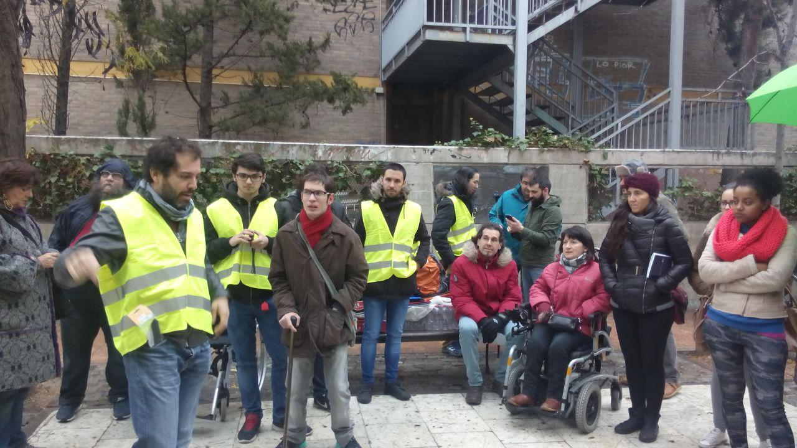

# Día Internacional de las personas con discapacidad y 2ª Mapping Party #zAccesibilidad

Aprovechando que el 3 de diciembre se celebra el [día internacional de las personas con discapacidad](https://es.wikipedia.org/wiki/D%C3%ADa_Internacional_de_las_Personas_con_Discapacidad), desde el grupo Mapeado Colaborativo y la Cátedra lo celebramos con la realización de la segunda _Mapping Party_ de accesibilidad, que además de la localización (el barrio de la Magdalena) tuvo notables diferencias con [respecto a la primera](http://blogzac.es/mapping-party-zaccesibilidad-67-9-mayo/). La más notable es que, en esta ocasión, la realizamos conjuntamente con la asociación [Discapacitados Sin Fronteras de Aragón](https://discapacitadossinfronteras.com/), quienes han integrado dentro del currículum educativo de su [XVIII Seminario sobre diversidad funcional](https://discapacitadossinfronteras.com/seminarios/) la toma de datos relativos a la accesibilidad y posterior publicación en [OpenStreetMap](http://openstreetmap.org). Fruto de esta colaboración, una veintena de alumnos participaron en la _Mapping Party_después de haber recibido una pequeña formación previa sobre OSM de la mano de uno de los coordinadores del grupo, César Canalís.

Por otra parte hemos aprovechado la ocasión para complementar el trabajo de campo con la realización realizar fotografías de vista de calle (_á la StreetView_ de Google) utilizando por un lado el servicio [Mapillary](http://mapillary.com) (a quienes agradecedemos enormemente que nos hayan suministrado desinteresadamente una colección de soportes para cámaras y móviles) y por otro el registro de fotografías en 360º con la cámara de los [Laboratorios de Ciencia Ciudadana](http://cesar-etopia.bifi.es) de [Etopía](http://www.zaragoza.es/ciudad/etopia/).

<iframe id="twitter-widget-1" scrolling="no" allowtransparency="true" allowfullscreen="true" class="twitter-tweet twitter-tweet-rendered" style="position: static; visibility: visible; display: block; width: 500px; height: 578.5px; padding: 0px; border: medium none; max-width: 100%; min-width: 220px; margin-top: 10px; margin-bottom: 10px;" data-tweet-id="804981276675571712" title="Tweet de Twitter" frameborder="0"></iframe><iframe id="twitter-widget-2" scrolling="no" allowtransparency="true" allowfullscreen="true" class="twitter-tweet twitter-tweet-rendered" style="position: static; visibility: visible; display: block; width: 500px; height: 556.1px; padding: 0px; border: medium none; max-width: 100%; min-width: 220px; margin-top: 10px; margin-bottom: 10px;" data-tweet-id="804982054081413120" title="Tweet de Twitter" frameborder="0"></iframe>

A las 10:00 empezó puntual la _Mapping Party_ con una bienvenida y una explicación del trabajo que realizaríamos. Posteriormente se formaron 5 grupos que recorrerían cada uno las distintas zonas previamente delimitadas y a cada uno se le facilitó una carpeta que contenía los _fieldpapers_ de la zona que tenían que mapear así como unas tablas para facilitar la toma de datos[¹](#fncde4de26) y un pequeño refrigerio cortesía de Eboca vending.

Además, en cada grupo estaba acompañado por uno de los coordinadores[²](#fn2), que íbamos claramente identificados con un chaleco reflectante. También esto fue una novedad muy positiva, ya que además de la ventaja de poder identificar claramente a los grupos, fruto de la visibilidad que proporcionan los chalecos conseguimos captar la atención de numerosos vecinos que se interesaron por la actividad que estábamos realizando y por tanto contribuyeron a la concienciación de más personas, que era uno de los objetivos de la actividad.

### Resultados

Tras varias horas de trabajo, y a pesar del frío y la lluvia que quiso sumarse puntualmente, conseguimos mapear con gran detalle anchuras de calles, bordillos, pasos de peatones, pavimentos, existencia (o ausencia) de semáforos acústicos y pavimentos táctiles… de gran parte de la Magdalena.

<iframe id="twitter-widget-3" scrolling="no" allowtransparency="true" allowfullscreen="true" class="twitter-tweet twitter-tweet-rendered" style="position: static; visibility: visible; display: block; width: 500px; height: 431.1px; padding: 0px; border: medium none; max-width: 100%; min-width: 220px; margin-top: 10px; margin-bottom: 10px;" data-tweet-id="804998801006149632" title="Tweet de Twitter" frameborder="0"></iframe><iframe id="twitter-widget-4" scrolling="no" allowtransparency="true" allowfullscreen="true" class="twitter-tweet twitter-tweet-rendered" style="position: static; visibility: visible; display: block; width: 500px; height: 462.35px; padding: 0px; border: medium none; max-width: 100%; min-width: 220px; margin-top: 10px; margin-bottom: 10px;" data-tweet-id="805008907433283584" title="Tweet de Twitter" frameborder="0"></iframe><iframe id="twitter-widget-5" scrolling="no" allowtransparency="true" allowfullscreen="true" class="twitter-tweet twitter-tweet-rendered" style="position: static; visibility: visible; display: block; width: 500px; height: 453.5px; padding: 0px; border: medium none; max-width: 100%; min-width: 220px; margin-top: 10px; margin-bottom: 10px;" data-tweet-id="805068038185844737" title="Tweet de Twitter" frameborder="0"></iframe>

Y también varias secuencias de las vistas de calle de las que os hablábamos al principio:

<iframe id="twitter-widget-6" scrolling="no" allowtransparency="true" allowfullscreen="true" class="twitter-tweet twitter-tweet-rendered" style="position: static; visibility: visible; display: block; width: 500px; height: 578.5px; padding: 0px; border: medium none; max-width: 100%; min-width: 220px; margin-top: 10px; margin-bottom: 10px;" data-tweet-id="805353748025503745" title="Tweet de Twitter" frameborder="0"></iframe><iframe id="twitter-widget-7" scrolling="no" allowtransparency="true" allowfullscreen="true" class="twitter-tweet twitter-tweet-rendered" style="position: static; visibility: visible; display: block; width: 500px; height: 594.117px; padding: 0px; border: medium none; max-width: 100%; min-width: 220px; margin-top: 10px; margin-bottom: 10px;" data-tweet-id="805709215549575168" title="Tweet de Twitter" frameborder="0"></iframe>

Destacar también que durante la actividad, un pequeño equipo del Heraldo de Aragón se acercó para interesarse por la actividad y al día siguiente apareció publicada una reseña en la versión digital y en papel al día siguiente.

<iframe id="twitter-widget-8" scrolling="no" allowtransparency="true" allowfullscreen="true" class="twitter-tweet twitter-tweet-rendered" style="position: static; visibility: visible; display: block; width: 500px; height: 431.1px; padding: 0px; border: medium none; max-width: 100%; min-width: 220px; margin-top: 10px; margin-bottom: 10px;" data-tweet-id="805380064250658816" title="Tweet de Twitter" frameborder="0"></iframe>

### Segunda parte: subida de datos

El punto final a la _mapping party_ la puso la sesión del lunes 5 de diciembre para la subida de datos a OpenStreetMap. César y Héctor estuvieron acompañando y guiando a los asistentes que se acercaron a la sede de Las Armas para introducir los datos tomados en el campo. Hay que recordar que aunque se trate de una actividad mucho menos visible y festiva que la toma de datos, es tanto o más importante, puesto que es lo que da sentido a la actividad (¡a fin de cuentas la hacemos para que todos esos datos estén en OSM!)

<iframe id="twitter-widget-9" scrolling="no" allowtransparency="true" allowfullscreen="true" class="twitter-tweet twitter-tweet-rendered" style="position: static; visibility: visible; display: block; width: 500px; height: 350.467px; padding: 0px; border: medium none; max-width: 100%; min-width: 220px; margin-top: 10px; margin-bottom: 10px;" data-tweet-id="805681363835817985" title="Tweet de Twitter" frameborder="0"></iframe>

### Agradecimientos

Por último queremos agradecer a todos los que han participado en este trabajo colaborativo: a los participantes en la actividad (en especial con aquellos que repiten participación), a Mapillary por el material suministrado desinteresadamente, a eboca vending que repiten contribuyendo con sus refrigerios para los asistentes y muy en especial a Discapacitados Sin Fronteras Aragón, con quienes hemos trabajado muy a gusto y esperamos poder repetir. ¡Sin todos vosotros esta _mapping party_ no hubiese sido la misma!

<iframe id="twitter-widget-10" scrolling="no" allowtransparency="true" allowfullscreen="true" class="twitter-tweet twitter-tweet-rendered" style="position: static; visibility: visible; display: block; width: 500px; height: 556.1px; padding: 0px; border: medium none; max-width: 100%; min-width: 220px; margin-top: 10px; margin-bottom: 10px;" data-tweet-id="804991235689746433" title="Tweet de Twitter" frameborder="0"></iframe><iframe id="twitter-widget-11" scrolling="no" allowtransparency="true" allowfullscreen="true" class="twitter-tweet twitter-tweet-rendered" style="position: static; visibility: visible; display: block; width: 500px; height: 556.1px; padding: 0px; border: medium none; max-width: 100%; min-width: 220px; margin-top: 10px; margin-bottom: 10px;" data-tweet-id="804990803114344448" title="Tweet de Twitter" frameborder="0"></iframe>

______

¹ Esto supone también una pequeña mejora respecto a la mapping party anterior que, además de homogeneizar el criterio en la toma de datos (algo muy útil para facilitar la posterior subida a OSM), también sirve de recordatorio para no olvidarse los aspectos más importantes relativos a la accesibilidad y para tomar las notas más rápidamente.

² Agradecemos la colaboración de Héctor Ochoa, miembro del grupo Mapeado Colaborativo y de OSM-Aragón, que se ofreció a liderar uno de los grupos.

